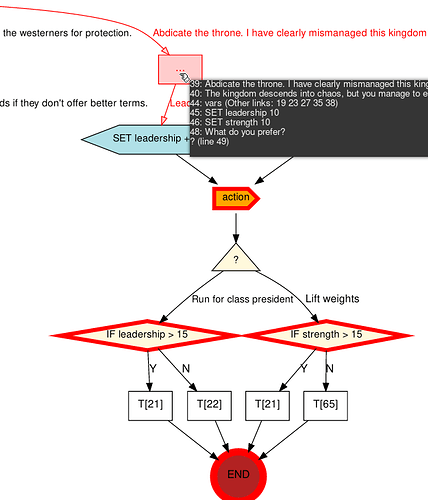
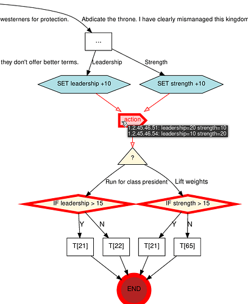

# Choicescript Analyzer

This is a frontend to a choicescript choice-tree analysis tool I'm working on. It lets you upload a scene file and produces a graphviz tree showing all possible values of the game's stats at different parts of the story. See it online [here](https://flurrywinde.pythonanywhere.com).

## Motivation

Tracking all the possible values of a game’s stats is the hardest part of writing a game for me, so for a long time, I've been looking for a tool that would make a graphical tree representation of a scene.

One day I found [choicescript-graphviz](https://github.com/mmitch/choicescript-graphviz) which is a (still incomplete, sadly) tool that parses choicescript code into graphviz. It was a start!

Then I found [Rich](https://github.com/Textualize/rich) which can make trees.

I combined these two things, and this was the result:

The code for this isn't on github yet as it's still in proof-of-concept phase and very messy, but with it, you can already open and close nodes, traverse the tree using the arrow keys, etc.

Then I added the stat analysis part which led to the creation of this tool which uses [Flask](https://github.com/pallets/flask) and [Python Anywhere](https://pythonanywhere.com) to host a site that lets choicescript authors try it out. This repo is for the development of this aspect of the project.

## What It Does

The [webpage hosted on pythonanywhere.com](https://flurrywinde.pythonanywhere.com) lets you upload a scene .txt file, processes it, and send the resultant graphviz tree to an [online graphviz renderer by dreampuf](https://github.com/dreampuf/GraphvizOnline).

Nodes considered irrelevant to stat analysis will be condensed like so:

This is just the choicescript example game (slightly modified). The block with the … in it contains a number of choicescript lines of code, which can be viewed by hovering over it as shown above.

Nodes with a thick red border indicate parts of the story where one or more stats could have several different values. Hover over those to see them:

In this simple example, leadership and strength are what can be different at this point in the story. The green numbers are the line numbers of the path taken to get there.

## Still Not Supported

Mostly due to the parser, [mmitch's choicescript-graphviz](https://github.com/mmitch/choicescript-graphviz), being incomplete, not all aspects of choicescript are supported yet:

- `*else` and `*elseif`

	- Still works; the tree will just be incorrect.

- Multiple scene files

	- There will be an error if the scene doesn't define the stat, i.e. it's done in startup.txt by *create.

- *gotoref

TODO: Add more to the above list.

Note: My plan is to work on these things in the order they're in above.

## TO-DO List

- Better error messages instead of just a 500 Server Error.

- Put the interactive text tree online too.
